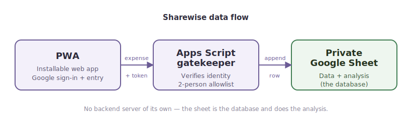

# Sharewise

**A private, two-person household expense tracker that lives in your own Google Sheet.**

Sharewise is a small Progressive Web App for logging shared household spending. You
tap in an expense; it's written straight into a private Google Sheet that does the
real work — categorizing, splitting, and surfacing trends. It's built for a household
of two who want Splitwise-style tracking without accounts, ads, or their financial
data leaving their own spreadsheet.

## Live demo

**[sharewise-olive.vercel.app](https://sharewise-olive.vercel.app)**

Access is restricted to the two owner accounts, so visitors will land on the Google
sign-in screen — that's the gatekeeper working as intended.

## Features

- **Quick expense entry** — installable as a PWA, opens full-screen, logs an expense in seconds.
- **Restricted Google sign-in** — only two allowlisted Google accounts can write; everyone else is turned away.
- **Your data, your sheet** — entries live in your own private Google Sheet, not in any third-party database.
- **Automatic analysis** — category breakdown, per-person fair share and settle-up balance, monthly trends, and habit metrics (impulse buys, eating out, quick-commerce orders).
- **In-app Insights** — a dedicated screen with charts, so you don't have to open the sheet to see where the money went.

## How it works

Sharewise is a thin front end. The sheet does the thinking. The app sends each
expense, along with a Google identity token, to an Apps Script gatekeeper that
verifies who you are and enforces the two-person allowlist before appending a row
to the private sheet.

## Privacy & security

- **The repository holds code only** — no expenses, no credentials, no sheet identifiers. Reading the source reveals nothing that grants access.
- **Financial data stays in the owner's private Google Sheet**, behind a Google login.
- **Only two allowlisted accounts can write.** That rule is enforced server-side by the Apps Script gatekeeper, which checks each request's verified Google identity — not something a reader of this code can fake.
- The one sensitive value (the Apps Script endpoint) is injected at build time from an environment variable and is never committed.

## Screenshots

<!-- Screenshots are placeholders — actual PNGs to be added to docs/. -->

| | |
|---|---|
|  |  |
| *Add expense* | *Insights & charts* |

*Google Sheet dashboard*

## Tech stack

Vanilla HTML/JS Progressive Web App · [Chart.js](https://www.chartjs.org/) for the
Insights charts · Google Apps Script as the gatekeeper · Google Sheets as the data
store and analysis engine · deployed on Vercel. No backend server and no database of
its own.

## Setup

Deployment is documented step by step in **[DEPLOYMENT.md](DEPLOYMENT.md)**. In
short, four pieces fit together:

1. **Google Sheet** — the database and analysis dashboard.
2. **Apps Script gatekeeper** — bound to the sheet; verifies identity and enforces the allowlist.
3. **Google OAuth client** — powers the in-app Google sign-in.
4. **Vercel** — hosts the PWA and injects configuration at build time.

## Categories

Categories are managed in the sheet's **Settings** tab. Add or rename one there and
it flows automatically to the app's entry form and to the Insights charts the next
time you sign in.
