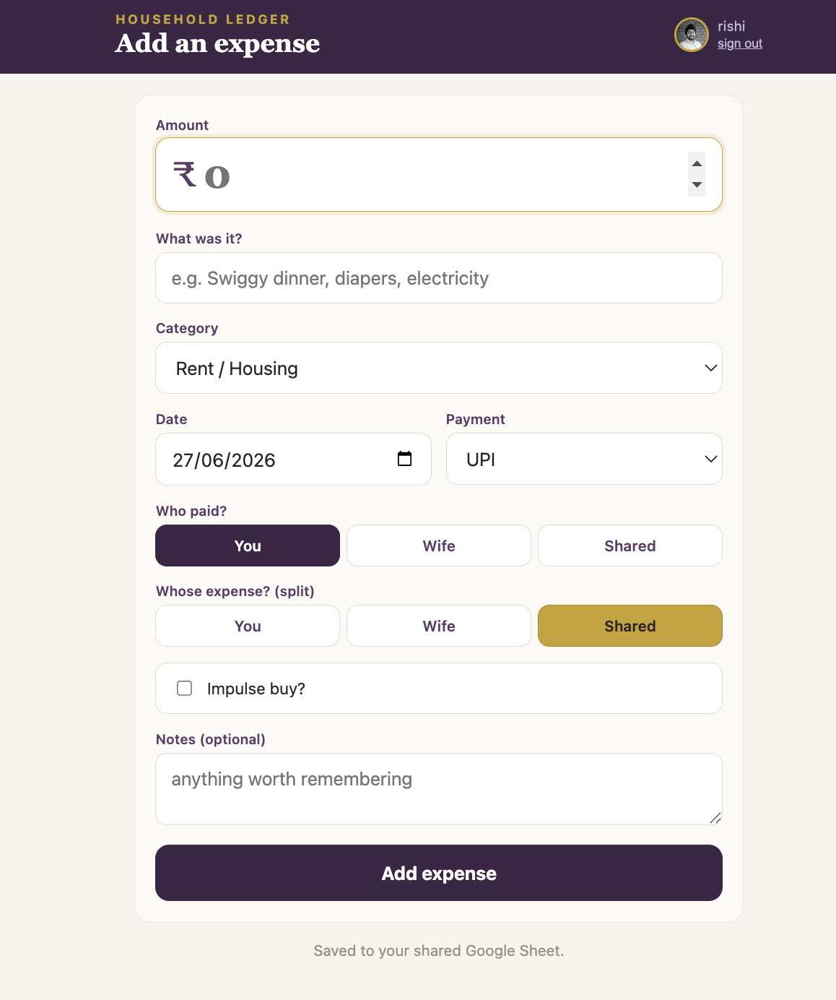
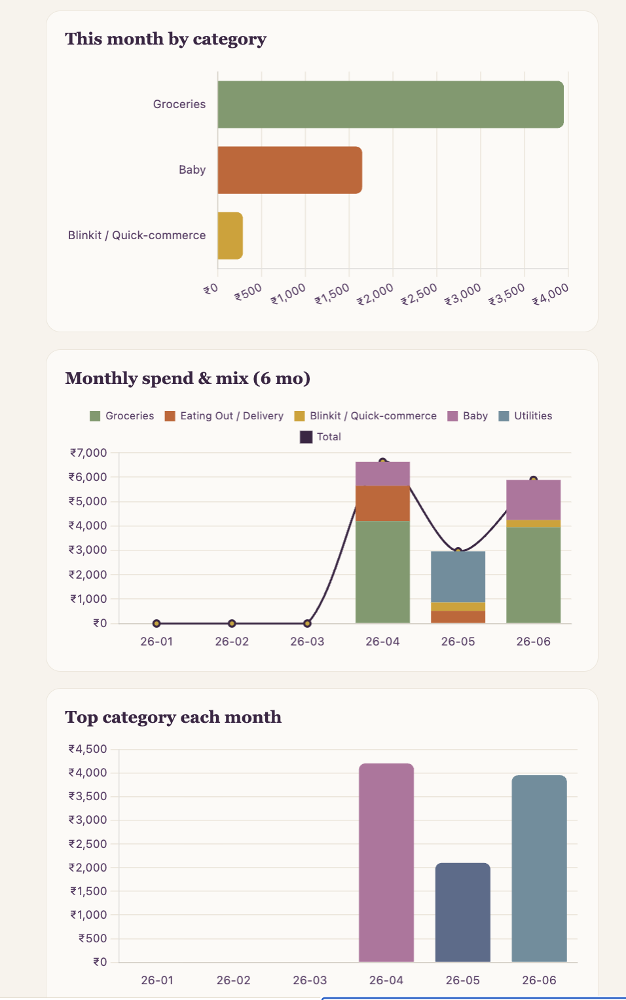
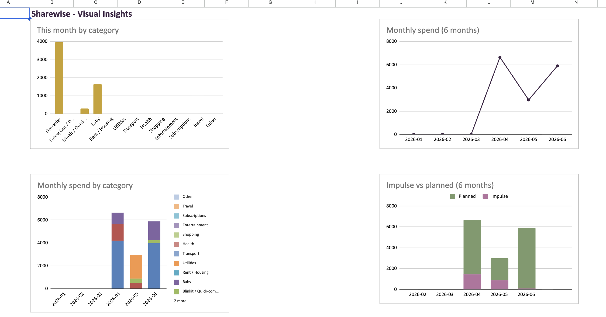

# Sharewise

A small, private expense tracker for a household of two. Open the app, tap in
what you spent, and it lands in a shared Google Sheet where the real analysis
lives — category breakdowns, who-owes-whom, monthly trends, and spending-habit
insights.

It's a Splitwise-style entry app with none of the accounts, ads, or data
leaving your own Google Sheet. You own the data; the app is just a friendly
front door to it.

## What it does

- **Log an expense in seconds** — amount, item, category, who paid, whose
  expense it is (yours, your partner's, or shared), payment method, and an
  impulse-buy flag.
- **Split shared expenses any way you like** — an even 50/50 by default, or a
  custom split entered in rupees *or* percentages, with a live readout that
  shows the split always adds up to the total.
- **See the picture, in-app** — an Insights screen with the month's totals,
  the running settle-up balance, each person's paid-vs-fair-share, and charts:
  spend by category, a six-month trend, the top category each month, and
  impulse-vs-planned spending.
- **Full analysis in the sheet** — the Google Sheet has a live Dashboard and a
  Charts tab that go deeper than the app, and update automatically as rows
  arrive.
- **Installs like an app** — it's a PWA; add it to your phone's home screen and
  it opens full-screen.

## Screenshots


*Logging an expense — amount, category, who paid, and how it's split.*


*The Insights screen — monthly totals, settle-up balance, and charts.*


*The Google Sheet — the live dashboard and analysis behind the app.*

## How it works

Sharewise is a thin front end. The sheet does the thinking.

```
   ┌──────────────┐     ┌──────────────────┐     ┌─────────────────────────┐
   │   The app    │ ──▶ │  Gatekeeper      │ ──▶ │  Private Google Sheet   │
   │ (log expense)│     │ (checks identity)│     │  (analysis + dashboard) │
   └──────────────┘     └──────────────────┘     └─────────────────────────┘
```

1. You log an expense in the app.
2. A Google Apps Script "gatekeeper" verifies your Google identity, checks it
   against a two-person allowlist, and appends the row.
3. The sheet's formulas turn rows into analysis — spend by category, each
   person's fair share and the running settle-up balance (honouring custom
   splits), annual projections, and habit metrics.

## Privacy & access

- Only **two specific Google accounts** can write to the sheet. Everyone else is
  turned away — the rule is enforced server-side, not in this code.
- **Financial data never lives in this codebase.** It stays in the Google
  Sheet, behind a Google login. This repository contains the app's code only —
  no expenses, no credentials. The one sensitive value (the script's URL) is
  injected at build time from an environment variable and never committed.

So this repo is safe to keep public.

## Install on your phone

Open the app's web address, sign in with an allowlisted Google account, then add
it to your home screen:

- **iPhone (Safari):** Share → Add to Home Screen.
- **Android (Chrome):** menu ⋮ → Add to Home screen / Install app.

## Categories

The category list is whatever's in the sheet's **Settings** tab. Add or rename a
category there and the app picks it up the next time you sign in.

## Tech

Vanilla HTML/CSS/JS (no framework), Chart.js for the in-app charts, Google
Apps Script as the gatekeeper, Google Sheets as the database and analysis
engine, deployed on Vercel. No backend server and no database of its own.

## Fork it for your own household

Want your own copy for you and your partner? The full from-scratch setup —
building the sheet, the gatekeeper script, the Google sign-in credential, and
the Vercel deploy — is in [`SETUP.md`](./SETUP.md).

---

*A personal project, shared in case it's useful to others.*
